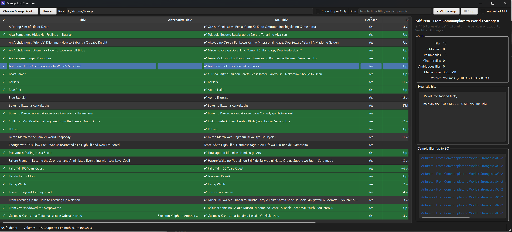

# Manga List Classifier

A PySide6 desktop tool that scans a "Manga Root" folder and classifies each
manga subfolder as **Volume-based**, **Chapter-based**, or **Both** using
filename heuristics on `.cbz` / `.zip` / `.cbr` / `.rar` / `.7z` / `.cb7`
archives.



## Download

Grab the latest `MangaList-vX.Y.Z-win-x64.zip` from the
[Releases](../../releases) page, unzip it anywhere, and run `MangaList.exe`.
No installer and no Python required — settings and cache are written to a
`data/` folder next to the executable, so it works fine from a USB stick.

Windows SmartScreen will likely show a "Windows protected your PC" warning
because the executable is not code-signed. Choose **More info → Run anyway**, or
build it yourself with the instructions below.

To verify your download against the published `.sha256` file:

```powershell
Get-FileHash MangaList-vX.Y.Z-win-x64.zip -Algorithm SHA256
```

## Install (from source)

```powershell
python -m venv .venv
.\.venv\Scripts\Activate.ps1
pip install -r requirements.txt
```

## Run

```powershell
python -m manga_list
```

Click **Choose Manga Root…**, pick the folder that contains your per-manga
subfolders, and the table will populate. Click any row to see sample filenames
and the heuristic hits behind the verdict in the right-hand pane.

## Folder name conventions recognized

Manga folder names may be in any of these forms:

- `<Romanized Title>` — e.g. `7-Nin no Nemuri Hime`
- `<English Title>` — e.g. `A Dating Sim of Life or Death`
- `<Romanized Title> [<English Title>]` — e.g. `Jitsu wa Ore, Saikyou deshita [Am I Actually the Strongest]`

Romanized text and raw JP/KR/CN UTF-8 are both accepted.

## Heuristics (summary)

For every archive file inside a manga folder (scanned to a depth of 3):

- `has_volume`  — matches `Vol`, `Vol.`, `Volume`, or bare `v01` style tokens
- `has_chapter` — matches `Ch`, `Ch.`, `Chapter`, `Chp`, or bare `c003` tokens
- A file with **both** tokens (e.g. `Vol. 1 Ch 3`) counts as a **chapter**.
- Files at depth 0 vs. inside a subfolder are tracked separately so the "volumes
  in parent + chapters in subfolder" pattern can be detected as **Both**.
- Median file size and total file count nudge ambiguous cases (chapters tend to
  be many small files; volumes tend to be fewer larger files).

The exact weights live as constants in `manga_list/classifier.py` and are easy
to tune.

## Phase 2 (planned, not implemented)

- CSV / JSON export of the table
- Right-click "Open folder", "Open in explorer"
- Rename helpers (e.g. normalize `Vol.1` → `Vol. 01`)
- Batch actions

## Tests

```powershell
pip install -r requirements-dev.txt
python -m pytest -q
```

## Build Executable

### Windows

Build a single-file executable with PyInstaller:

```powershell
# Using the build script
.\build.bat

# Or manually
pip install -r requirements-dev.txt
pyinstaller MangaList.spec --clean
```

Output: `dist/MangaList.exe` — a self-contained executable that includes Python and all dependencies.

### Notes

- The executable is built with `--windowed` (no console window)
- The `data/` directory (SQLite cache and config) is created at runtime in the executable's directory
- First launch may be slightly slower as the bundled libraries are extracted

## GitHub Actions

- `Tests` — runs the pytest suite on Windows across Python 3.10–3.12 for every push and pull request.
- `Build Executable` — builds the Windows executable on every push and uploads it
  as a build artifact. Pushing a `v*` tag additionally packages
  `MangaList-v<tag>-win-x64.zip` plus a SHA256 checksum and attaches both to a
  **draft** release, which you then review and publish manually.

### Cutting a release

The version is derived from the git tag, so there is nothing to bump by hand:

```powershell
git tag v0.2.0
git push origin v0.2.0
```

CI stamps `manga_list/_version.py` with the tag (minus the leading `v`), builds,
and opens the draft release. Non-tag builds report `0.0.0+<short-sha>`.

## Data sources & attribution

Series metadata is fetched from third-party APIs. This project is not affiliated
with, endorsed by, or sponsored by either service.

- **[MangaUpdates](https://www.mangaupdates.com)** — series matching, licensing
  status, and scanlation/publisher progress, via the
  [MangaUpdates API](https://api.mangaupdates.com/). Used in accordance with their
  Acceptable Use Policy: requests are rate-limited (`REQUEST_DELAY` in
  `manga_list/mu_client.py`) and all responses are cached locally under `data/`.
- **[AniList](https://anilist.co)** — supplementary volume/chapter counts via the
  [AniList GraphQL API](https://docs.anilist.co/).

### Fetching the MangaUpdates API spec

The OpenAPI spec is not vendored in this repository. Fetch the current version if
you need it while working on `manga_list/mu_client.py`:

```powershell
curl -o openapi.yaml https://api.mangaupdates.com/openapi.yaml
```

Only two endpoints are used: `POST /series/search` and `GET /series/{id}`.

## License

[MIT](LICENSE) — applies to this project's own source code. Data retrieved at
runtime from the services above remains the property of its respective owners.
