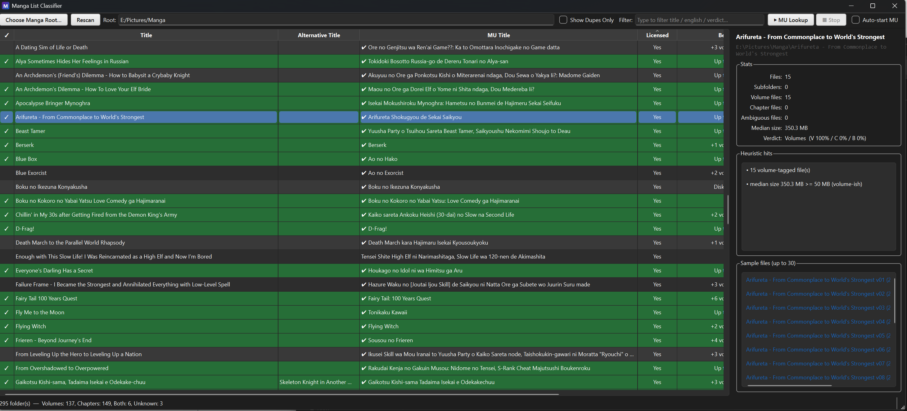

# MangaList

A PySide6 desktop tool that scans a "Manga Root" folder, classifies each manga subfolder as
**Volume-based**, **Chapter-based** or **Both** from its archive file names (`.cbz`, `.zip`, `.cbr`,
`.rar`, `.7z`, `.cb7`), and matches it to [MangaUpdates](https://www.mangaupdates.com) to show what
is licensed, finished or behind.



## Install

Download from the [Releases](../../releases) page:

| System | File |
| --- | --- |
| Windows x64 | `MangaList-vX.Y.Z-windows-x64-setup.exe` (per-user install, no admin rights; upgrades in place) or the portable `-windows-x64.zip` |
| macOS | `MangaList-vX.Y.Z-macos-arm64.dmg` (Apple silicon) or `-macos-x64.dmg` (Intel): drag MangaList to Applications |
| Linux x64 | `MangaList-vX.Y.Z-linux-x64.AppImage` (`chmod +x`, then run; glibc 2.35+) or the `-linux-x64.tar.gz` folder |

The builds are not code-signed. Check a download against `SHA256SUMS` (`sha256sum -c SHA256SUMS
--ignore-missing`, or `Get-FileHash <file>` on Windows); on first launch:

- **Windows** SmartScreen: **More info > Run anyway**.
- **macOS** Gatekeeper: right-click the app > **Open**, or on macOS 15+ **System Settings > Privacy &
  Security > Open Anyway**.

### Docker / Unraid

The image runs the same desktop app in the browser (on
[jlesage/baseimage-gui](https://github.com/jlesage/docker-baseimage-gui)), plus a headless runner that
rescans the library on a schedule. It is not published to a registry yet; build it from a checkout:

```sh
docker build -f packaging/docker/Dockerfile -t mangalist .
docker run -d --name mangalist -p 5800:5800 \
  -v /mnt/user/appdata/mangalist:/config -v /mnt/user/<library share>:/data mangalist
```

Then open `https://<host>:5800/`. The certificate is self-signed unless you put your own in
`/config/certs`. HTTPS is on because browsers only allow clipboard sync with the host over HTTPS.
`USER_ID` / `GROUP_ID` default to Unraid's `99` / `100`. The scheduled rescan is `MANGALIST_RESCAN_SCHEDULE`
(default `daily@03:30`, `off` to disable). Downloads stay off unless `MANGALIST_DOWNLOADS=1`.

> **Local use only - do not expose it to the internet.** MangaList is a personal, single-user desktop
> app, not a server: the web GUI has **no login**, and whoever opens it can rename and move files in
> the library mounted at `/data`. Keep port 5800 on your home network and reach it from outside
> through a VPN or [Tailscale](https://tailscale.com/), never through a port forward or a public
> reverse proxy.

## Your data

Settings, the MangaUpdates cache and logs live per user, so upgrades and uninstalls keep them:
`%LOCALAPPDATA%\MangaList` (Windows), `~/Library/Application Support/MangaList` (macOS),
`~/.local/share/MangaList` (Linux). The portable zip keeps them in `data\` next to `MangaList.exe`.
Older versions kept `data\` next to the program; the first start copies it over once.
`MANGALIST_DATA_DIR` points it elsewhere.

## Run from source

```sh
pip install -r requirements-dev.txt
python -m mangalist          # --version, or --smoke-test for a headless start check
python -m pytest -q
```

Folder names may be `Title`, `English Title` or `Romanized Title [English Title]`.

## MangaUpdates matching

**Check MU** uses `mangalist/matcher/`, a Python port of the
[MangaPixer](https://github.com/dixit92/mangapixer) 1.31.1 matcher with the same rules and
thresholds. It first decides whether a folder is one work (a series, a series with `Volumes/` /
`Chapters/` / `Season N/` subfolders, or a one-shot) and matches only those. It searches a few title
variants (and a second results page on a tie), then scores candidates by title similarity (sequel
numbers count) and local evidence: the highest volume / chapter numbers against the record's
totals, years, the category folder, author names in brackets or after `by`, and related records
(a spin-off named only by the folder's subtitle always needs review). MangaPixer's cover comparison
and admin-declared types are not ported: MangaList has neither covers nor declarations.

The **MU Title** column shows the result:

- *auto*: a normal, unconfirmed match.
- *needs review*: orange, with the reasons in the tooltip.
- *unmatched* / *not one work*: nothing is linked. Use **Fix MangaUpdates match…** to pick one.

A confirmed match (✔) is never re-scored. The golden tests in `tests/golden` replay recorded public
MangaUpdates responses and check that the results equal MangaPixer's.

## Build and release

CI (`.github/workflows`) runs the tests on Windows, macOS and Linux and builds every package
(PyInstaller via `MangaList.spec`, scripts in `packaging/`) for each push to `main` and each pull
request. Versions are calendar versions `YEAR.MONTH.N` (`2026.9.0`); each release has a section in
[CHANGELOG.md](CHANGELOG.md), which says how to cut one. Pushing a `vYEAR.MONTH.N` tag creates a
draft release with the packages, `SHA256SUMS` and that section as its notes. Build locally with
`python packaging/make_icon.py && pyinstaller MangaList.spec --clean --noconfirm` (`build.bat` on
Windows).

## Data sources & attribution

Not affiliated with, endorsed by, or sponsored by either service.

- **[MangaUpdates](https://www.mangaupdates.com)**: series matching, licensing and progress via the
  [MangaUpdates API](https://api.mangaupdates.com/), rate-limited (`REQUEST_DELAY` in
  `mangalist/mu_client.py`), with matches cached locally. The golden-test fixtures are recorded
  public MangaUpdates data (series data © MangaUpdates).
- **[AniList](https://anilist.co)**: supplementary volume / chapter counts via the
  [AniList GraphQL API](https://docs.anilist.co/).

## License

[MIT](LICENSE) for this project's code. Data from the services above belongs to its owners.
